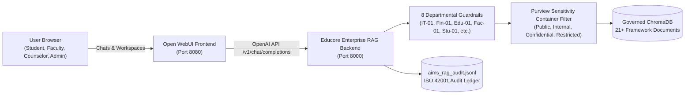

# Educore Services Enterprise RAG: Open WebUI Operation Guide

## 1. System Overview
This deployment integrates **Open WebUI** as the enterprise frontend for the **Educore Services AI Platform**, strictly governed by the **Educore AI Framework (EDU-AIMS-HBK-v1.0 & EDU-AIMS-POL-v1.0)**.

The solution provides a certifiable **ISO/IEC 42001:2023 Artificial Intelligence Management System (AIMS)**, fully compliant with:
- **Zambian Data Protection Act (No. 3 of 2021)**: National Registration Card (NRC) masking, DPIA statutory alignment.
- **EU AI Act (Article 5)**: Complete prohibition of student/staff emotion tracking and facial recognition.
- **NIST AI Risk Management Framework**: Zero-trust multi-tenant Role-Based Access Control (RBAC).

---

## 2. Architecture & Components



---

## 3. Dedicated Open WebUI Enterprise Models

When accessing Open WebUI (`http://localhost:8080`), select any of the 7 pre-configured Educore models from the model dropdown:

| Model ID in Open WebUI | Target User | Clearance Level | Governing Scope & Guardrails |
| :--- | :--- | :--- | :--- |
| **`educore-enterprise-all`** | All Institutional Staff | Adaptive | Universal enterprise model; dynamically adapts to authenticated clearance and Purview boundaries. |
| **`educore-socratic-student`** | Students & Learners | `Tier C` (Public) | **Socratic Diagnostic Hints Only** (Guardrail Stu-01). Prohibits homework answer dumping; includes Adelaide model sole-authorship pledge. |
| **`educore-faculty-academic`** | Teaching Faculty & Curriculum Leads | `Tier B` (Staff) | Cambridge IGCSE Math 0580 syllabus, lesson planning, rubric design, Edu-03 student PII depersonalization. Automated grading strictly blocked (Edu-01). |
| **`educore-pastoral-counselor`** | Campus Pastoral Counselors | `Tier A` (Confidential) | Authorized review of confidential student welfare cases (e.g. Case #402). Egress PII shield masks Zambian phone numbers and NRCs. |
| **`educore-finance-audit`** | Bursars & Finance Officers | `Tier A` (Finance) | M365 Copilot Finance emulation; automatically attaches Guardrail Fin-01 Dual-Key Manual Audit notices and anonymizes FQM mining partner subsidies. |
| **`educore-it-devops`** | IT Engineers & Systems Admins | `Tier A` (Restricted IT) | GitHub Copilot Enterprise emulation; enforces IT-01 secret scanning (blocking AWS keys, private keys) and SAST peer review rules. |
| **`educore-admin-governance`** | Campus Heads & Executives | `Tier A` (Executive) | Cross-campus multi-tenant governance (Sentinel, Trident, Frontier), 6-Step AIIA management, and ISO 42001 compliance telemetry. |

---

## 4. Quick Launch Instructions

### 1-Click Launch (PowerShell)
```powershell
.\start_educore_enterprise.ps1
```

### 1-Click Launch (Command Prompt)
```cmd
start_educore_enterprise.bat
```

### Endpoints
- **Open WebUI Web Interface**: [http://localhost:3000](http://localhost:3000) (or `http://localhost:8080`)
- **Educore Governance OpenAI API**: [http://localhost:8000/v1](http://localhost:8000/v1)
- **Health Check & Telemetry**: [http://localhost:8000/health](http://localhost:8000/health)
- **ISO 42001 Live Audit Ledger**: [http://localhost:8000/api/audit](http://localhost:8000/api/audit)
- **Local Audit Log File**: `aims_rag_audit.jsonl`

---

## 5. Security & Compliance Verification

The platform has been verified with automated test suites:
- `test_educore_enterprise_backend.py`: **12/12 passing** (RBAC boundaries, 8 departmental guardrails, Socratic diagnostic hints, Purview containers).
- `production_setup/test_rag_pipeline.py`: **7/7 passing** (Cross-campus isolation, indirect prompt injection defense, egress PII shielding).

---

## 6. Authentication Modes & Troubleshooting

### Understanding Open WebUI's Authentication Safeguard
If you see the notification:
> *"You can't turn off authentication because there are existing users. If you want to disable WEBUI_AUTH, make sure your web interface doesn't have any existing users and is a fresh installation"*

This is Open WebUI's built-in safeguard:
- When `WEBUI_AUTH=False` (disabled authentication), Open WebUI automatically signs in via the internal system account (`admin@localhost`).
- If an admin or user account was already registered in the database under a different email while authentication was previously enabled, Open WebUI blocks turning off authentication to prevent orphaned user chats or unintentional data exposure.

### Option A: Running in Passwordless Mode (`WEBUI_AUTH=False`)
For development, demonstrations, or single-user environments where no login screen is desired:
1. Ensure the database is fresh with 0 conflicting user accounts.
2. Open WebUI will automatically initialize the local admin session (`admin@localhost`) with zero login prompts.
3. Anyone navigating to `http://localhost:3000` is immediately admitted to the chat interface.

### Option B: Running in Enterprise Authenticated Mode (`WEBUI_AUTH=True`)
For real multi-campus institutional deployment (Sentinel, Trident, Frontier) adhering to Educore AI Framework Zero-Trust RBAC:
1. In `start_educore_enterprise.ps1` and `start_educore_enterprise.bat`, set:
   ```env
   WEBUI_AUTH=True
   ```
2. Users log in with institutional credentials.
3. Access rights map to their respective clearance level (`student`, `faculty`, `pastoral`, `finance`, `it_admin`), ensuring full ISO/IEC 42001:2023 audit traceability per user identity.

