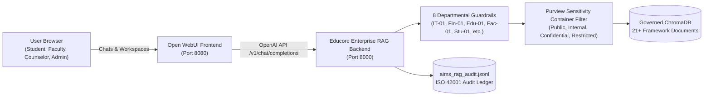
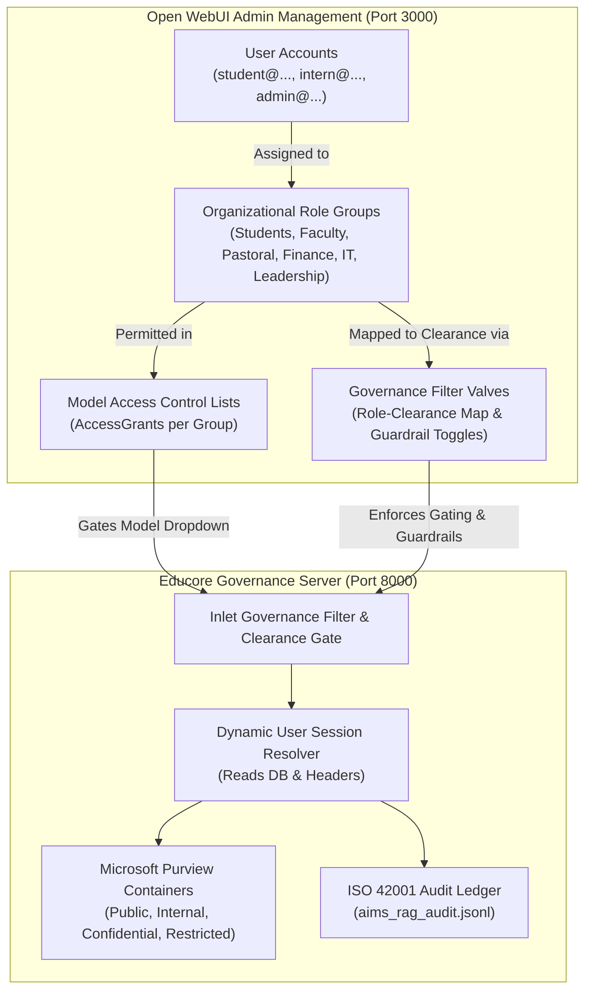

# Educore Services Enterprise RAG: Open WebUI Operation Guide

## 1. System Overview
This deployment integrates **Open WebUI** as the enterprise frontend for the **Educore Services AI Platform**, strictly governed by the **Educore AI Framework (EDU-AIMS-HBK-v1.0 & EDU-AIMS-POL-v1.0)**.

The solution provides a certifiable **ISO/IEC 42001:2023 Artificial Intelligence Management System (AIMS)**, fully compliant with:
- **Zambian Data Protection Act (No. 3 of 2021)**: National Registration Card (NRC) masking, DPIA statutory alignment.
- **EU AI Act (Article 5)**: Complete prohibition of student/staff emotion tracking and facial recognition.
- **NIST AI Risk Management Framework**: Zero-trust multi-tenant Role-Based Access Control (RBAC).

---

## 2. Architecture & Components



---

## 3. Dedicated Open WebUI Enterprise Models

When accessing Open WebUI (`http://localhost:8080`), select any of the 7 pre-configured Educore models from the model dropdown:

| Model ID in Open WebUI | Target User | Clearance Level | Governing Scope & Guardrails |
| :--- | :--- | :--- | :--- |
| **`educore-enterprise-all`** | All Institutional Staff | Adaptive | Universal enterprise model; dynamically adapts to authenticated clearance and Purview boundaries. |
| **`educore-socratic-student`** | Students & Learners | `Tier C` (Public) | **Socratic Diagnostic Hints Only** (Guardrail Stu-01). Prohibits homework answer dumping; includes Adelaide model sole-authorship pledge. |
| **`educore-faculty-academic`** | Teaching Faculty & Curriculum Leads | `Tier B` (Staff) | Cambridge IGCSE Math 0580 syllabus, lesson planning, rubric design, Edu-03 student PII depersonalization. Automated grading strictly blocked (Edu-01). |
| **`educore-pastoral-counselor`** | Campus Pastoral Counselors | `Tier A` (Confidential) | Authorized review of confidential student welfare cases (e.g. Case #402). Egress PII shield masks Zambian phone numbers and NRCs. |
| **`educore-finance-audit`** | Bursars & Finance Officers | `Tier A` (Finance) | M365 Copilot Finance emulation; automatically attaches Guardrail Fin-01 Dual-Key Manual Audit notices and anonymizes FQM mining partner subsidies. |
| **`educore-it-devops`** | IT Engineers & Systems Admins | `Tier A` (Restricted IT) | GitHub Copilot Enterprise emulation; enforces IT-01 secret scanning (blocking AWS keys, private keys) and SAST peer review rules. |
| **`educore-admin-governance`** | Campus Heads & Executives | `Tier A` (Executive) | Cross-campus multi-tenant governance (Sentinel, Trident, Frontier), 6-Step AIIA management, and ISO 42001 compliance telemetry. |

---

## 4. Quick Launch Instructions

### 1-Click Launch (PowerShell)
```powershell
.\start_educore_enterprise.ps1
```

### 1-Click Launch (Command Prompt)
```cmd
start_educore_enterprise.bat
```

### Endpoints
- **Open WebUI Web Interface**: [http://localhost:3000](http://localhost:3000) (or `http://localhost:8080`)
- **Educore Governance OpenAI API**: [http://localhost:8000/v1](http://localhost:8000/v1)
- **Health Check & Telemetry**: [http://localhost:8000/health](http://localhost:8000/health)
- **ISO 42001 Live Audit Ledger**: [http://localhost:8000/api/audit](http://localhost:8000/api/audit)
- **Local Audit Log File**: `aims_rag_audit.jsonl`

---

## 5. Security & Compliance Verification

The platform has been verified with automated test suites:
- `test_educore_enterprise_backend.py`: **12/12 passing** (RBAC boundaries, 8 departmental guardrails, Socratic diagnostic hints, Purview containers).
- `production_setup/test_rag_pipeline.py`: **7/7 passing** (Cross-campus isolation, indirect prompt injection defense, egress PII shielding).

---

## 6. Authentication Modes & Troubleshooting

### Understanding Open WebUI's Authentication Safeguard
If you see the notification:
> *"You can't turn off authentication because there are existing users. If you want to disable WEBUI_AUTH, make sure your web interface doesn't have any existing users and is a fresh installation"*

This is Open WebUI's built-in safeguard:
- When `WEBUI_AUTH=False` (disabled authentication), Open WebUI automatically signs in via the internal system account (`admin@localhost`).
- If an admin or user account was already registered in the database under a different email while authentication was previously enabled, Open WebUI blocks turning off authentication to prevent orphaned user chats or unintentional data exposure.

### Option A: Running in Passwordless Mode (`WEBUI_AUTH=False`)
For development, demonstrations, or single-user environments where no login screen is desired:
1. Ensure the database is fresh with 0 conflicting user accounts.
2. Open WebUI will automatically initialize the local admin session (`admin@localhost`) with zero login prompts.
3. Anyone navigating to `http://localhost:3000` is immediately admitted to the chat interface.

### Option B: Running in Enterprise Authenticated Mode (`WEBUI_AUTH=True`)
For real multi-campus institutional deployment (Sentinel, Trident, Frontier) adhering to Educore AI Framework Zero-Trust RBAC:
1. In `start_educore_enterprise.ps1` and `start_educore_enterprise.bat`, set:
   ```env
   WEBUI_AUTH=True
   ENABLE_FORWARD_USER_INFO_HEADERS=True
   ```
2. Users log in with institutional credentials.
3. Access rights map to their respective clearance level (`student`, `faculty`, `pastoral`, `finance`, `devops`, `admin`), ensuring full ISO/IEC 42001:2023 audit traceability per user identity.

---

## 7. Open WebUI User Accounts, Roles & Clearance Administration Guide

### 7.1 Architecture Overview



### 7.2 Institutional Role & Clearance Matrix

| Open WebUI Group | Target Institutional Persona | Clearance Tier | Permitted Purview Containers | Permitted Models | Enforced Guardrails |
| :--- | :--- | :--- | :--- | :--- | :--- |
| **`Students`** | Students & Learners | `Tier C` (Public) | Public / Educational | `educore-socratic-student` | **Stu-01**: Socratic hints only; homework answer dumping blocked. Adelaide pledge required. |
| **`Faculty`** | Teaching Faculty & HODs | `Tier B` (Staff) | Public / Educational<br>Internal - Educational | `educore-faculty-academic`<br>`educore-enterprise-all` | **Edu-01**: Summative grading ban.<br>**Edu-02**: Cambridge 0580 syllabus verification.<br>**Edu-03**: Student PII de-id. |
| **`Pastoral Counselors`** | Campus Pastoral Care | `Tier A` (Pastoral) | Public / Educational<br>Internal - Educational<br>Confidential - Welfare | `educore-pastoral-counselor`<br>`educore-enterprise-all` | Confidential safeguarding case review (e.g. Case #402). Egress phone and Zambian NRC shield. |
| **`Finance & Bursary`** | Bursars & Accountants | `Tier A` (Finance) | Public / Educational<br>Internal - Educational<br>Confidential - Finance | `educore-finance-audit`<br>`educore-enterprise-all` | **Fin-01**: Dual-Key manual audit notice appended to all financial calculations. FQM subsidies masked. |
| **`IT & Systems DevOps`** | IT Engineers & SysAdmins | `Tier A` (Restricted IT) | Public / Educational<br>Internal - Educational<br>Confidential / Restricted | `educore-it-devops`<br>`educore-enterprise-all` | **IT-01**: Pre-commit secret scanning (AWS keys, RSA private keys). SAST peer review rules. |
| **`Campus Leadership / Admins`** | Campus Heads, Execs, Admins | `Tier A` (Executive) | **All Purview Containers**<br>(Cross-campus Sentinel, Trident, Frontier) | **All 7 Educore Models**<br>including `educore-admin-governance` | Multi-campus governance, 6-Step AIIA management, ISO 42001 audit ledger review. |

---

### 7.3 How the Admin Manages Users & Roles on Open WebUI

All user-role-model management is performed directly inside Open WebUI:

#### Step 1: Managing User Accounts
1. Log in to Open WebUI as the Administrator (`admin@localhost`).
2. Navigate to **Admin Panel** (click profile icon in bottom-left -> **Admin Panel**).
3. Under **Users**, you can view all registered accounts, approve pending registrations, or adjust base roles (`admin` or `user`).

#### Step 2: Assigning Users to Organizational Role Groups
1. In **Admin Panel**, navigate to **Users** -> **Groups** (or `http://localhost:3000/admin/groups`).
2. You will see the 6 pre-configured Educore Groups:
   - `Students`
   - `Faculty`
   - `Pastoral Counselors`
   - `Finance & Bursary`
   - `IT & Systems DevOps`
   - `Campus Leadership / Admins`
3. Click on any group (e.g., `Faculty`), select **Members**, and add or remove user accounts.
4. When a user is added to a group, they immediately inherit:
   - Access to the AI models permitted for that group.
   - The organizational clearance level (Tier C, B, or A) mapped to that group.

#### Step 3: Managing What AI Models Each Role Can Use (Model Access Control)
1. Navigate to **Workspace** -> **Models** (in the left sidebar).
2. For each Educore model, click **Edit (Pencil Icon)**.
3. Under **Access Control**:
   - Change access from *Public* to specific Groups.
   - Select the authorized groups according to the matrix in Section 7.2.
4. When a user logs in, Open WebUI's UI **only displays the models their assigned group is permitted to use**. Unpermitted models are completely hidden and inaccessible.

#### Step 4: Configuring Clearance Rules & Guardrails in Open WebUI
1. Navigate to **Workspace** -> **Functions** (in the left sidebar).
2. Locate the **Educore AI Framework Governance & Clearance Filter**.
3. Click the **Valves (Gear Icon)**:
   - **`role_clearance_map`**: Adjust the JSON mapping linking groups to clearance tiers.
   - **`default_clearance`**: Set the fallback clearance tier for newly registered users (default: `public` for Zero-Trust).
   - **`enforce_model_clearance_gating`**: Toggle strict enforcement preventing users from querying models above their clearance level.
   - **`enforce_socratic_student`**: Toggle cognitive bypass prevention and diagnostic hints.
   - **`enforce_emotion_ban`**: Toggle EU AI Act Article 5 emotion tracking prohibition.
   - **`enforce_secret_scanning`**: Toggle IT-01 pre-commit secret detection.
   - **`enforce_fin_dual_key`**: Toggle Fin-01 dual-key verification notices.
4. Click **Save** to apply changes instantly with zero server restarts required.

---

### 7.4 Automated RBAC Provisioning Script

To automatically synchronize or reset all groups, model access grants, and governance valves:
```powershell
.\framework_control\Scripts\python.exe setup_openwebui_rbac.py
```
This utility automatically initializes the 6 groups, links existing user accounts, configures model access control lists, and registers the global governance filter in `webui.db`.

